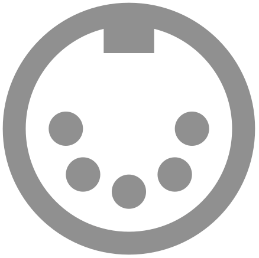
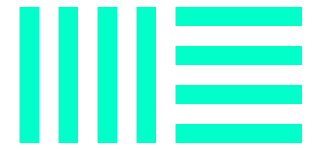

# Hello, my name is Jason

|  | If I'm not taking something apart to understand how it works, I'm fixing something that I broke while taking it apart to understand how it worked.
| - | :- |

|  | Curiosity, knowledge, growth and improvement are all motivators for me to keep expanding upon my various disciplines of study.
| - | :- |

|  | I continually draw upon my varied experiences from the music, management, HVAC, plumbing, culinary and coding worlds. I combine them with my explorations of philosophy and logic in order to enrich my life and the lives of others.
| - | :- |

|  | My current focus is learning C++ and the JUCE framework in order to build virtual instruments as VST plugins.  
| - | :- |
 

 
 

<!-- ## 🎹 <kbd>+</kbd> 💻 
Currently, my primary focus is on computer programming with the ultimate goal of creating software-based musical instruments that are accessible to individuals of all skill levels, including those who are new to music as well as experienced musicians. I am motivated to develop these tools in order to provide a intuitive and creative platform for people to explore and express their musical abilities.

  -->

<!-- 
## 🛠️ 

If I'm not taking something apart to understand how it works, I'm fixing something that I broke while taking it apart to understand how it worked. 

## 🔎 

Curiosity, knowledge, growth and improvement are all motivators for me to keep expanding upon my various disciplines of study. I continually draw upon my varied experiences from the music, management, HVAC, plumbing, culinary and coding worlds. I combine them with my explorations of philosophy and logic in order to enrich my life and the lives of others.
 -->
## Tech I am Familiar With

| Programming Languages |
| -|
| &nbsp;  &nbsp;  &nbsp;  &nbsp;  &nbsp;   &nbsp;  

| Frameworks and Libraries | 
| - |
&nbsp;  &nbsp;  &nbsp;  &nbsp;   &nbsp;  &nbsp;  &nbsp;   

| Database Technology | 
| - |
&nbsp;  &nbsp; 

| Version Control and Collaboration | 
| - |
&nbsp;  &nbsp;  &nbsp;   &nbsp;  &nbsp; 

| Development Tools | 
| - |
&nbsp;  &nbsp;  &nbsp;  &nbsp;  &nbsp;  
<!-- &nbsp;  -->

| A/V Production Tools | 
| - |
&nbsp;  &nbsp;  &nbsp;  &nbsp;  &nbsp;  &nbsp;  
 
 

<!-- 
 
 
 
  -->
<!-- https://github.com/anuraghazra/github-readme-stats/blob/master/themes/README.md -->
<!--   -->

